<!-- /.github/profile/README.md -->

 

 
 

**Tenbyte builds robust software and operates modern IT services for businesses.** 
We combine clean architecture, proven best practices, and pragmatic delivery on-prem and in the cloud.

 

## Technology Stack

 

 
 

**Email:** info@tenbyte.de &nbsp;|&nbsp; **Web:** <a href="https://tenbyte.de">tenbyte.de</a> &nbsp;|&nbsp; **Imprint & legal:** <a href="https://tenbyte.de/impressum">tenbyte.de/impressum</a>

 

 
© Tenbyte Technologies GmbH • Crafted with &#9829; in Munich &#x1F968; 

